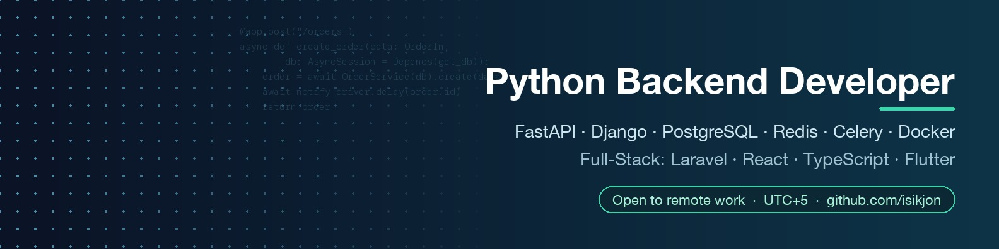

  

<h2 align="center">Hi, I'm Iskandar — Python Backend Developer</h2>

  I design and ship production backends end-to-end: architecture, database, APIs, integrations, deployment. 
  5+ years of commercial work · Tashkent, Uzbekistan (UTC+5) · <b>open to remote roles</b>

  
  
  

## What I do

- **Backends on Python** — FastAPI, Django / DRF, async SQLAlchemy 2.0, Alembic, Pydantic
- **Data & async work** — PostgreSQL, Redis, Celery, schema design, query optimization
- **Real-time & integrations** — WebSocket, payments, POS (iikoCloud), telephony (Zadarma), voice AI (Retell), maps (2GIS), Firebase, Telegram Bot API
- **Infrastructure** — Docker Compose, Nginx, Linux VPS, SSL, CI basics
- **Full-stack when needed** — Laravel / Filament, React, Next.js, TypeScript; mobile apps in Flutter
- **Security-minded** — OWASP Top 10, JWT, 2FA/OTP, Argon2, rate limiting, RBAC

## Featured projects

| Project | What it is | Stack |
|---|---|---|
| [**Logtex CRM**](https://github.com/isikjon/logtex) | Custom Frappe CRM app for B2B sales: Zadarma telephony, Retell AI voice bot that fills the client card after a call, outbound dialing by filters, duplicate detection and data-quality checks, e2e tests | Python · Frappe · REST integrations |
| **EcoTaxi / Wazir KG** | Taxi platform for Kyrgyzstan: REST + WebSocket API for drivers, clients and dispatchers, real-time geolocation, 2GIS maps, RBAC, push notifications, driver balance and photo control. Driver and client apps in Flutter | FastAPI · PostgreSQL · Celery · Redis · WebSocket · Flutter |
| [**Makovka**](https://github.com/isikjon/makovka_backend) | Loyalty app for a bakery chain: phone + OTP auth, JWT, iikoCloud POS integration (guests, cards, bonus sync) and a Flutter client | FastAPI · SQLAlchemy 2.0 async · asyncpg · Alembic · Flutter |
| [**Donskih club app**](https://github.com/isikjon/donskih) | Mobile club app with its own backend: layered FastAPI (api / services / repositories), JWT, Redis, pytest API tests, Flutter client with FCM push | FastAPI · PostgreSQL · Redis · pytest · Flutter · Firebase |
| **Bike rental CRM** | Monorepo CRM for a bike rental & buyout business | Express · TypeScript · Prisma · Next.js |
| [**Woodstream**](https://github.com/isikjon/woodstream_prod) | Antique furniture e-commerce with Filament admin, tuned for a large catalog, plus a real-time company messenger | Laravel 12 · Filament 3 · Reverb (WebSocket) · Docker |
| [**Unstop VPN**](https://github.com/isikjon/unstop_vpn) | Flutter VPN client on VLESS / V2Ray via native plugins, secure config storage | Flutter · Riverpod · native plugins |

## Stack

**Backend:**       
**Data:**     
**DevOps:**     
**Frontend & mobile:**    

## How I work

1. Clarify requirements and propose architecture, DB schema and API contract.
2. Deliver in short iterations with demos.
3. Ship to production with Docker, docs and a clear run guide — and support it after release.

**Languages:** English (B2) · Russian · Uzbek · Tajik
